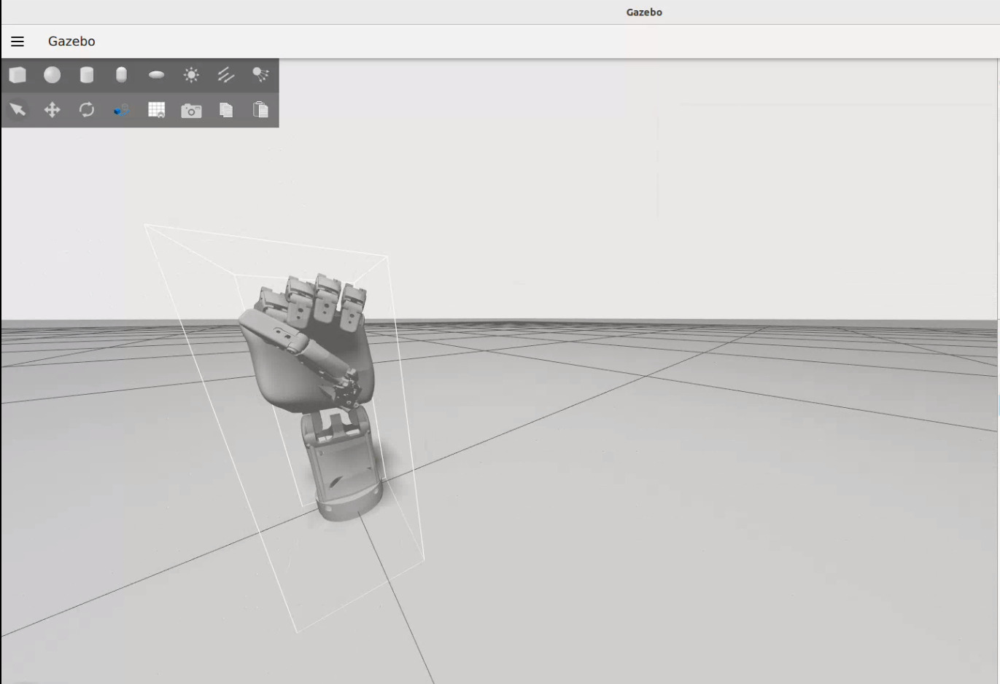

# ROS 2 Dexhand Control



*Dexhand running in Gazebo physics simulation environment*

## Overview

A custom ROS 2 simulation platform for a tendon-driven dexterous robotic hand. This project implements advanced robot kinematics and control techniques using URDF modeling, ros2_control integration, and contract-relax actuation strategies in Gazebo.

## Features

- **Tendon-Driven Architecture**: Realistic simulation of soft-actuated hand kinematics
- **URDF Modeling**: Comprehensive robot description for accurate simulation
- **ROS 2 Control Framework**: Leverages ros2_control for modular controller design
- **Contract-Relax Actuation**: Advanced control strategy for smooth hand operation
- **Gazebo Integration**: Physics-based simulation environment

## Installation

1. Clone the repository:
   ```bash
   git clone https://github.com/yourusername/ros2-dexhand-control.git
   cd ros2-dexhand-control/dexhand_ws
   ```

2. Install dependencies:
   ```bash
   rosdep install --from-paths src --ignore-src -r -y
   ```

3. Build the workspace:
   ```bash
   colcon build
   ```

4. Source the setup file:
   ```bash
   source install/setup.bash
   ```

## Usage

### Option 1: RViz Visualization
Launch RViz to visualize the hand model with interactive joint controls:
```bash
ros2 launch dexhandv2_description display.launch.py
```

### Option 2: Gazebo Simulation
Launch Gazebo for physics-based simulation:
```bash
ros2 launch dexhandv2_description gazebo_view.launch.py
```

### Run Hand Control Script
In a separate terminal, run the hand control node to demonstrate contract-relax actuation:
```bash
python3 src/dexhandv2_description/scripts/hand_test.py
```

This script demonstrates the contract-relax functionality, alternating between opening and closing the hand using the control plugin every 2 seconds.

## Requirements

- ROS 2 (Humble or later)
- Gazebo
- Python 3.8+
- ros2_control
- ign_ros2_control (for Gazebo simulation)

## Project Credits

Mesh files and hand design sourced from [TheRobotStudio/V1.0-Dexhand](https://github.com/TheRobotStudio/V1.0-Dexhand) repository.

**Control Architecture**: The contract-relax hand actuation is implemented using the ros2_control framework with custom control plugins, enabling smooth and coordinated finger movements.

## License

This project, including the Dexhand mesh files and design, is licensed under the **Creative Commons Attribution-NonCommercial-ShareAlike 4.0 International License** ([CC BY-NC-SA 4.0](http://creativecommons.org/licenses/by-nc-sa/4.0/)).

You are free to:
- Share and adapt the design
- Use for non-commercial purposes

Under the following terms:
- Attribution to The Robot Studio and this project
- Non-commercial use only
- Share alike - distribute derivatives under the same license

## Contributing

Contributions are welcome. Please submit pull requests or open issues for bugs and feature requests.
